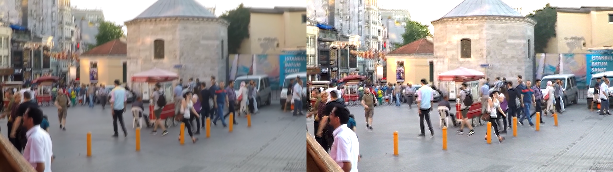

# Enfoque de imágenes con algoritmos genéticos

En este repositorio se presenta una aproximación al problema de enfocar una imagen utilizando para ello algoritmos genéticos y evolución interactiva.

Este código ha sido desarrollado y probado en PyCharm 2018.3 con Python 3.7. Mostramos a continuación los pasos que hay que seguir para ejecutar el código en PyCharm:

## Configuración

La configuración del algoritmo se hace a través del archivo de configuración `cfg/config.cfg`, en el cual vienen descritas las diferentes opciones que tenemos y los valores que pueden tomar.

La configuración específica del problema, incluyento la imagen que vamos a procesar, se hace a través del archivo de configuración `cfg/pcfg/deblurr_image_problem.cfg`, en el cual de nuevo vienen descritas las opciones que aparecen y sus valores.

## Ejecución del algoritmo genético

1. Importar proyecto en PyCharm.

2. Establecer la carpeta del proyecto como Working Directory.

3. Ejecutar el script: `src/model/Main.py`

4. En consola nos aparecerá la iteración actual con respecto al número de iteraciones totales. Cuando termine de ejecutarse el algoritmo, se nos mostrará una gráfica con la evolución del fitness (nivel de enfoque) de la población a lo largo de las generaciones, junto con las imágenes generadas. Las imágenes generadas se guardarán en la raiz del proyecto junto al kernel que las ha generado.

## Ejecución del algoritmo genético interactivo

1. Importar proyecto en PyCharm.

2. Establecer la carpeta del proyecto como Working Directory.

3. Ejecutar el script: `src/model/MainGUI.py`

4. Se mostrará la ventana de selección de imagen. Pulsamos el botón "Select Image" y elegimos la imagen que queremos procesar.

    

5. Una vez seleccionada la imagen, se mostrará en la GUI. 

    

6. Pulsamos el botón "Start" y el proceso evolutivo comenzará.

7. Se nos mostrará una ventana con la población actual. Seleccionando el checkbox correspondiente a cada imagen la estaremos seleccionando para la siguiente generación. Entondes podremos pulsar el botón "Save", para guardar la imagen seleccionada, o el botón "Next", para pasar a la siguiente generación. En la parte superior podremos variar los parámetros de probabilidad de mutación (Indica cuanto variarán los individuos en la siguiente generación), y la probabilidad de reproducción (Indica cuanto se recombinarán los individuos).

    

8. Las imágenes generadas se guardarán en la raiz del proyecto junto al kernel que las ha generado.

## Resultados

Mostramos a continuación algunos de los resultados obtenidos sobre las imágenes `images/blur-images/gopro.png` y `images/blur-images/torre-blurr.jpg`.

    

    